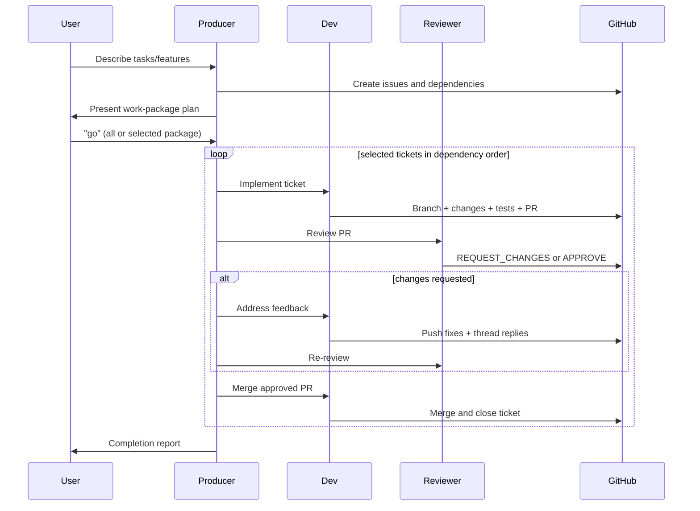

# Ticket and Work-Package Workflow

## Overview

This workflow is for teams using three roles:
- Producer: plans and orchestrates
- Dev: implements and tests
- Reviewer: reviews and approves

Work is organized as **tickets** grouped into **work packages**.

## Naming Convention

- Branch: `feature/{N}-kebab-title`
- PR title: `#{N} {Title}`
- Commit: `type: summary (Fixes #{N})`

## Quality Gates

Before PR:
- Dev must run relevant tests and include evidence in PR.

Before merge:
- Reviewer approval required.
- Blocking review threads resolved.

## MCP-First Guidance

Prefer GitHub MCP tools for issue/PR/review/merge operations.
Use terminal/git only if MCP lacks required capability.
