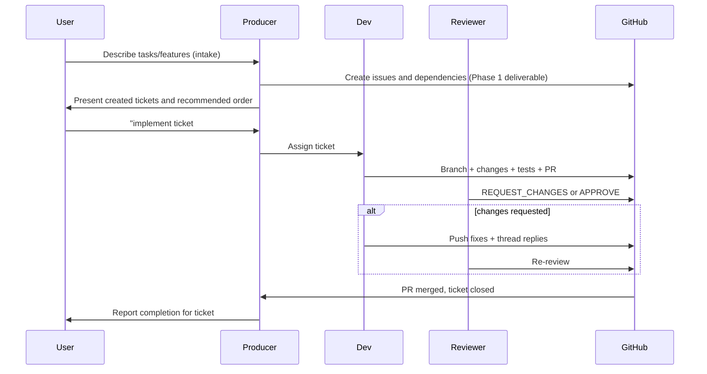

# Ticket-First Workflow (no work packages)

## Overview

This workflow is structured around two phases and a strict ticket-first approach. Roles:
- Producer: intake & ticket creation
- Dev: implements and tests when commanded
- Reviewer: reviews and approves

Key rules:
- Do NOT group tickets into work packages. Represent all work as individual GitHub Issues.
- Phase 1 (intake & ticket creation) is triggered by user input and is automatic — the Producer creates tickets and refines them with Dev as part of intake. The deliverable is the set of created tickets.
- Phase 2 (implementation) begins only when the user explicitly requests: `implement ticket #{N}`. At that point Dev implements the ticket, opens a PR, and the normal review/merge cycle proceeds.

```mermaid
sequenceDiagram
    participant User
    participant Producer
    participant Dev
    participant Reviewer
    participant GitHub

    User->>Producer: Describe tasks/features (intake)
    Producer->>GitHub: Create issues and dependencies (Phase 1 deliverable)
    Producer->>User: Present created tickets and recommended order

    User->>Producer: "implement ticket #N"
    Producer->>Dev: Assign ticket #N for implementation (Phase 2 start)
    Dev->>GitHub: Branch + changes + tests + PR
    Reviewer->>GitHub: REQUEST_CHANGES or APPROVE

    alt changes requested
      Dev->>GitHub: Push fixes + thread replies
      Reviewer->>GitHub: Re-review
    end

    GitHub->>Producer: PR merged, ticket closed
    Producer->>User: Report completion for ticket #N
```

## Naming Convention

- Branch: `feature/{N}-kebab-title`
- PR title: `#{N} {Title}`
- Commit: `type: summary (Fixes #{N})`

## Quality Gates

Before PR:
- Dev must run relevant tests and include evidence in PR.

Before merge:
- Reviewer approval required.
- Blocking review threads resolved.

## MCP-First Guidance

Prefer GitHub MCP tools for issue/PR/review/merge operations.
Use terminal/git only if MCP lacks required capability.
