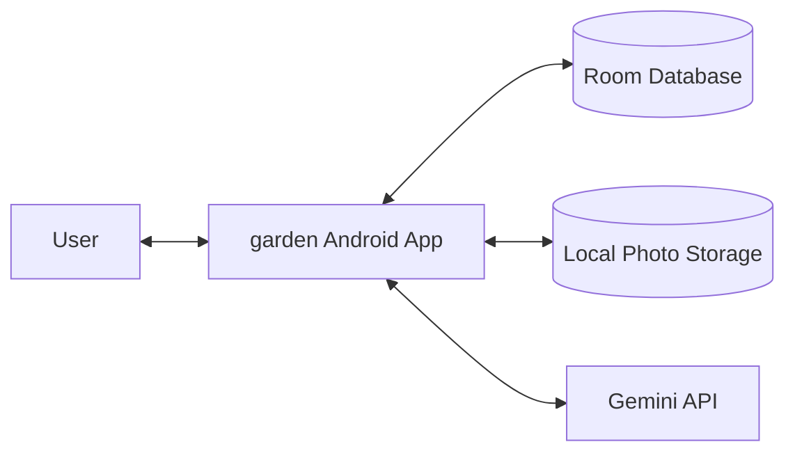

# 3. Context and Scope

### 3.1 Business Context
The app supports three main domains:
1. Plant identification and registration.
2. Plant profile management.
3. Care planning (general reference + current dynamic tasks).

### 3.2 Technical Context
**External systems/services**
- Gemini API: plant identification and photo-based health analysis.

**Internal boundaries**
- Android app (UI + business logic)
- Local Room database
- Local photo file/cache storage

### 3.3 Context Diagram

