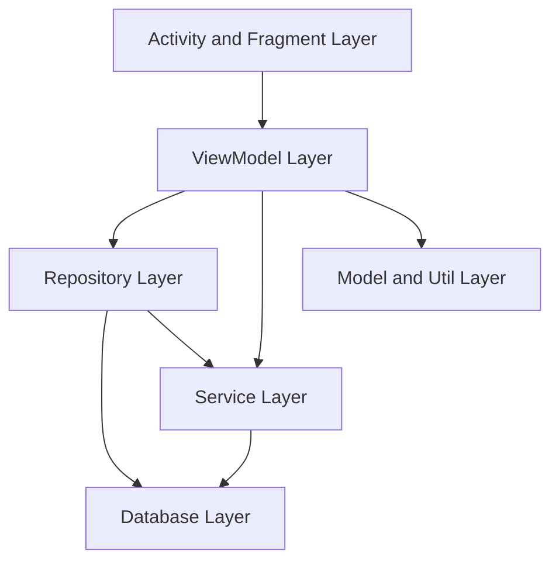

# 5. Building Block View

### 5.1 Level 1 - System Decomposition

### 5.2 Level 2 - Key Components
- `fragment/`
  - `GardenFragment`: plant list and entry points
  - `PlantDetailFragment`: profile, gallery, care sections
  - `CameraFragment`: photo capture flow
- `viewmodel/`
  - `GardenViewModel`: list/search/filter state
  - `PlantDetailViewModel`: detail state and care sections
  - `PhotoAnalysisViewModel`: upload/analysis orchestration
- `repository/`
  - `PlantRepository`, `PhotoRepository`, care-related repository classes
- `service/`
  - `GeminiAIService`, identification/analysis helpers
- `database/`
  - `AppDatabase`, DAOs, `PlantEntity`, `PhotoEntity`, `CarePlanEntity`, `CareTaskEntity`

### 5.3 Level 3 - Data-Centric Building Blocks
- Plant is the central aggregate.
- Photos, care plans, and care tasks are linked to a plant.
- Current tasks are generated/re-generated on demand and user-driven.

