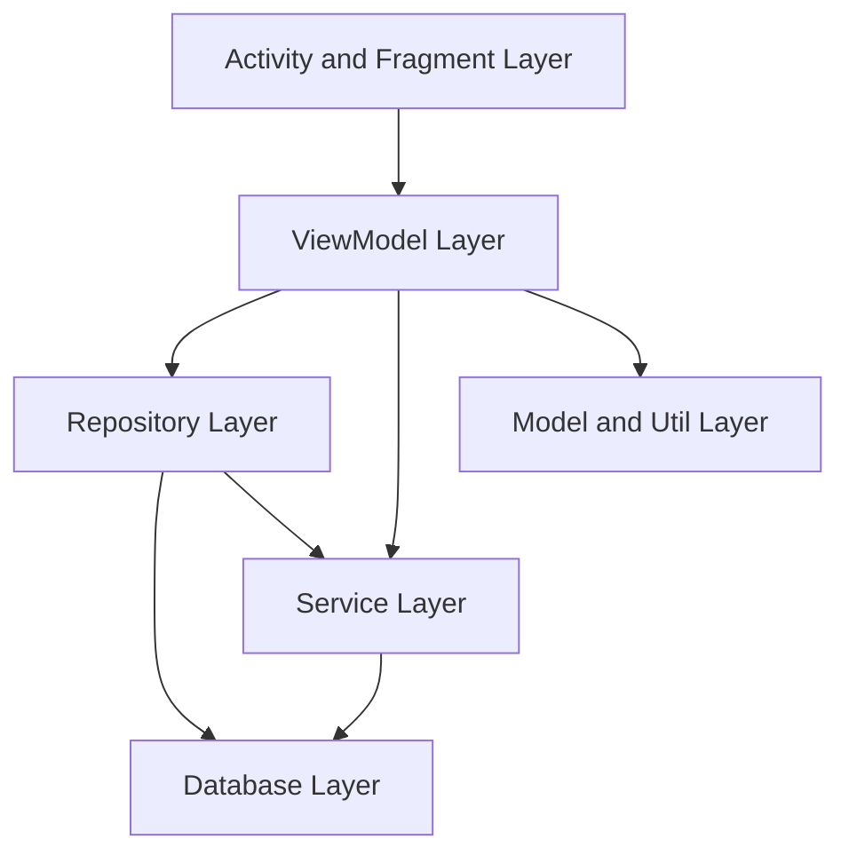

# 5. Building Block View

### 5.1 Level 1 - System Decomposition

```mermaid
flowchart TB
    UI[Activity and Fragment Layer]
    VM[ViewModel Layer]
    REPO[Repository Layer]
    SRV[Service Layer]
    DB[Database Layer]
    MODEL[Model and Util Layer]

    UI --> VM --> REPO
    VM --> SRV
    REPO --> DB
    REPO --> SRV
    SRV --> DB
    VM --> MODEL
```

### 5.2 Level 2 - Key Components
- `fragment/`
  - `MyPlantsFragment`: plant list and entry points
  - `PlantDetailFragment`: profile, gallery, care sections
  - `FullscreenGalleryFragment`: immersive photo viewing and AI summary display
  - `SettingsFragment`: app settings and locale selection
- `viewmodel/`
  - `MyPlantsViewModel`: list/search/filter state
  - `PlantDetailViewModel`: detail state and care sections
  - `CarePlanViewModel`: global care task aggregation
- `repository/`
  - `PlantRepository`: core plant and photo data
  - `LocalizedTextRepository`: Room-backed storage for dynamic translations (AI summaries, long-form info)
- `i18n/`
  - `LocaleManager`: manages current app locale and persistence
  - `ResourceLocalizationRepository`: hybrid repository fetching from DB or Android resources
- `service/`
  - `GeminiAIService`, identification/analysis helpers
- `database/`
  - `AppDatabase`, DAOs, `PlantEntity`, `PhotoEntity`, `CarePlanEntity`, `CareTaskEntity`

### 5.3 Level 3 - Data-Centric Building Blocks
- Plant is the central aggregate.
- Photos, care plans, and care tasks are linked to a plant.
- `LocalizedTextEntity` provides multi-language support for dynamic content.
- Current tasks are generated/re-generated on demand and user-driven.
