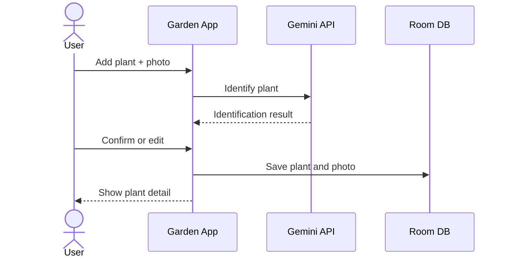

# 6. Runtime View

### 6.1 Add First Plant
1. User opens add flow from `GardenFragment`.
2. User captures/selects photo.
3. App processes image (resize/compress, metadata stripping).
4. App calls Gemini for plant identification.
5. User confirms/edits identification.
6. App persists plant + initial photo and shows detail screen.

### 6.2 Weekly Plant Check-In
1. User opens plant detail.
2. App loads profile, photos, and existing care data from Room.
3. User uploads new photo if needed.
4. App analyzes plant state via AI and updates current tasks.
5. User marks task complete/defer and adds notes.

### 6.3 Generate Current Care Tasks
1. Collect recent plant photos and relevant history.
2. Request health analysis from Gemini.
3. Merge AI findings with elapsed-time/task rules.
4. Persist/display current actionable tasks.

