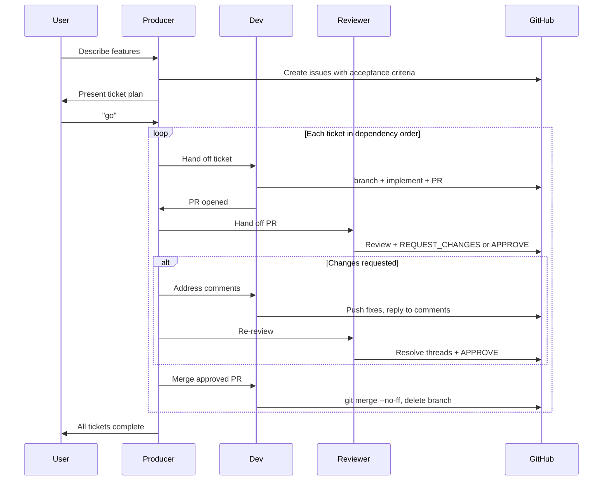

# Ticket Workflow

## Purpose

This chapter describes how the garden app team — both human and AI agents — works on individual features using a ticket-based development cycle. It covers the full lifecycle from feature description through GitHub Issue creation, implementation, code review, and merge.

---

## How It Works

### 1. User Describes Features → Producer Creates Tickets

The user describes a set of features to the **Producer (Remy)** agent. The Producer:

- Reads `docs/project-documentation/index.md` for current project state
- Breaks each feature into discrete, independently-implementable GitHub Issues
- Each issue includes: title, description, acceptance criteria, technical notes, and labels
- Presents a prioritized ticket plan to the user (with dependency order)
- **Waits for explicit user approval** before starting execution

Example output from the Producer:

```
## Ticket Plan — Room Database Layer

I've created 3 tickets:

| # | Title              | Labels         | Depends On |
|---|--------------------|----------------|------------|
| #2 | Room Entities     | database       | —          |
| #3 | Plant ViewModel   | mvvm, database | #2         |
| #4 | Garden Fragment   | ui             | #3         |

Estimated order: #2 → #3 → #4

Ready to start? Say "go" and I'll orchestrate the team.
```

### 2. User Says "Go" → Producer Orchestrates

Once the user approves, the Producer drives the execution loop for each ticket:



---

## Naming Conventions

Consistent naming makes tickets traceable end-to-end.

| Artifact | Pattern | Example |
|----------|---------|---------|
| **Branch** | `feature/{N}-kebab-title` | `feature/2-room-entities` |
| **PR Title** | `#{N} {Short Title}` | `#2 Room Entities` |
| **Commit** | `type: description (Fixes #{N})` | `feat: add PlantEntity (Fixes #2)` |
| **Merge** | `git merge --no-ff` | Always — never squash or rebase |

### Why `--no-ff`?

The `--no-ff` flag preserves each individual commit in the main branch history. This enables:
- Automatic GitHub issue closure via `Fixes #{N}` in commit messages
- Per-commit traceability back to the ticket that introduced each change
- Clean `git log` that shows when each ticket was merged

---

## GitHub Issue Template

Every ticket the Producer creates follows this structure:

```markdown
## What to Build
[1-3 sentences describing the feature and its purpose in the app]

## Acceptance Criteria
- [ ] [Specific, observable outcome]
- [ ] [Another criterion]
- [ ] Unit tests pass (`./gradlew test`)
- [ ] No hardcoded strings

## Technical Notes
[Relevant files, architecture decisions, patterns to follow]
[Reference: docs/project-documentation/ chapter if applicable]

## Definition of Done
- [ ] Branch `feature/{N}-kebab-title` pushed
- [ ] PR opened as `#{N} {Title}`
- [ ] Code Reviewer approved
- [ ] PR merged to main with `--no-ff`
- [ ] This issue auto-closed
```

---

## Code Review Standards

The Code Reviewer checks five categories in priority order:

### Blocking (must fix before merge)

| Category | Key Checks |
|----------|-----------|
| **Architecture** | MVVM followed, no Fragment refs in ViewModel, Room DAOs only, coroutines for async |
| **Code Quality** | No hardcoded strings/colors, ViewBinding only, focused methods, naming conventions |
| **Android-Specific** | API keys via `BuildConfig`, EXIF stripped before Gemini, errors handled gracefully |
| **Testing** | Unit tests for new business logic, Gemini API mocked, error paths covered |

### Non-Blocking (comment, but don't block merge)

| Category | Key Checks |
|----------|-----------|
| **Documentation** | Javadoc on public methods, inline comments for complex logic |

### Review Comment Format

```
[Category] — [Issue] and [why it matters].

Suggested fix: [concrete, actionable fix]

Reference: [docs/project-documentation/... or .github/instructions/...]
```

---

## Iteration Protocol

After the reviewer submits `REQUEST_CHANGES`:

1. **Dev reads all comments** — understands every thread
2. **Dev fixes issues** — commits to the same branch: `fix: address review comments (Fixes #N)`
3. **Dev pushes** — `git push origin feature/{N}-kebab-title`
4. **Dev replies to every comment** — references the commit hash where the fix lives
5. **Reviewer re-examines** — reads new commits, verifies fixes
6. **Reviewer resolves threads** — one by one as each fix is accepted
7. **Reviewer approves** — when all blocking threads resolved

---

## Agents Reference

| Agent | File | Role in Workflow |
|-------|------|-----------------|
| **Producer (Remy)** | `.github/agents/ai-team-producer.agent.md` | Creates tickets, presents plan, waits for "go", orchestrates handoffs, confirms closure |
| **Dev Team (Nova/Sage/Milo)** | `.github/agents/ai-team-dev.agent.md` | Reads issue, creates branch, implements, opens PR, iterates on review, merges |
| **Code Reviewer** | `.github/agents/code-reviewer.agent.md` | Reviews PR against standards, provides structured feedback, approves when ready |

Each agent definition is **self-contained** — it includes the full workflow that agent needs to execute its role without needing to reference external files.

---

## Worked Example: Ticket #2 Room Entities

### Producer Creates the Ticket

```
User: "We need Room entities for plants and photos."

Producer:
  - Reads project docs
  - Creates GitHub Issue #2: "Room Entities"
    - What to Build: PlantEntity, PhotoEntity, DAOs, AppDatabase
    - Acceptance Criteria: entities created, DAOs with CRUD, unit tests pass
    - Labels: database, android
  - Presents: "Created #2. Ready to start? Say 'go'."
```

### User Approves, Dev Implements

```
User: "go"

Producer → Dev: "Work on ticket #2: Room Entities"

Dev:
  - Reads issue #2 acceptance criteria
  - git checkout -b feature/2-room-entities
  - Implements PlantEntity, PhotoEntity, PlantDao, PhotoDao, AppDatabase
  - Writes unit tests
  - git push origin feature/2-room-entities
  - Opens PR: "#2 Room Entities"
  - Reports: "PR opened: #2 Room Entities"
```

### Producer Hands Off to Reviewer

```
Producer → Reviewer: "Review PR #2: Room Entities"

Reviewer:
  - Reads PR diff
  - Loads android-java.instructions.md, garden-plant-features.instructions.md
  - Finds: "PlantDao methods return raw List<PlantEntity>, not LiveData"
  - Adds inline comment:
    "Architecture — DAO methods must return LiveData<List<PlantEntity>>.
     This enables reactive UI updates (fragments observe and auto-refresh).
     Suggested fix: change return type to LiveData<> on all query methods.
     Reference: .github/instructions/garden-plant-features.instructions.md → Plant Entity Lifecycle"
  - Submits: REQUEST_CHANGES
```

### Dev Iterates

```
Dev:
  - Reads comment
  - Changes DAO return types to LiveData<>
  - git commit -m "fix: return LiveData from DAO queries (Fixes #2)"
  - git push
  - Replies: "Fixed in commit abc1234. All DAO methods now return LiveData."

Reviewer:
  - Re-reads commit abc1234
  - Verifies LiveData used correctly
  - Resolves thread ✅
  - Submits: APPROVE
  - "Review complete. All issues resolved. Ready to merge. Use git merge --no-ff."
```

### Dev Merges

```
Producer → Dev: "Reviewer approved #2. Merge."

Dev:
  - git checkout main && git pull origin main
  - git merge feature/2-room-entities --no-ff
  - git push origin main
  - git push origin --delete feature/2-room-entities
  - GitHub auto-closes issue #2 (via "Fixes #2" in commits)
  - Reports: "Ticket #2 merged and closed."
```

---

## Troubleshooting

**Q: PR has merge conflicts with main.**
```bash
git fetch origin
git merge origin/main  # or rebase if not yet pushed
# resolve conflicts
git push origin feature/{N}-...
```

**Q: Reviewer goes quiet mid-iteration.**
The PR is still open. Call the Reviewer agent again with: "Continue reviewing PR #{N} — dev has pushed fixes."

**Q: Dev is blocked (depends on another ticket not yet merged).**
Dev reports to Producer. Producer holds the ticket and moves to the next independent ticket first.

**Q: Two tickets have no dependencies — can they run in parallel?**
Yes. Producer can hand both to Dev simultaneously in separate branches. Each follows the same workflow independently.

