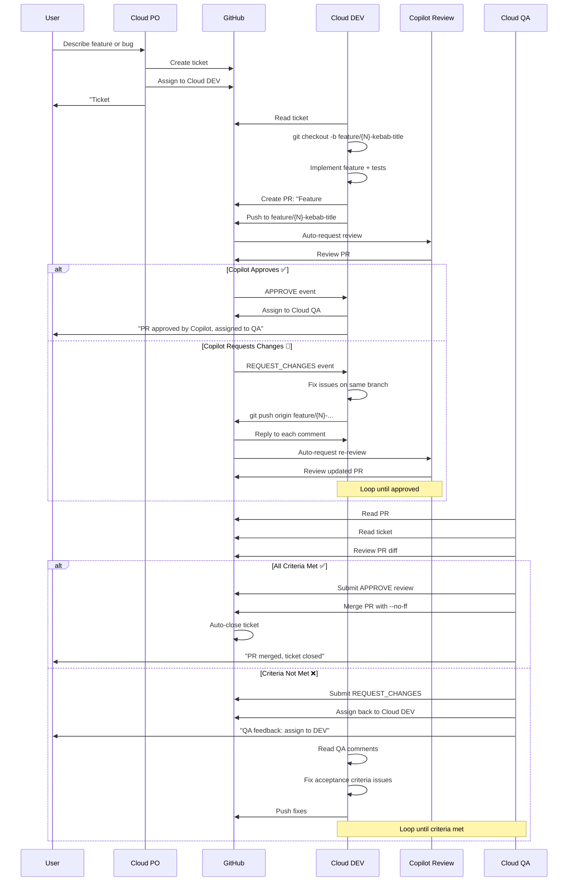
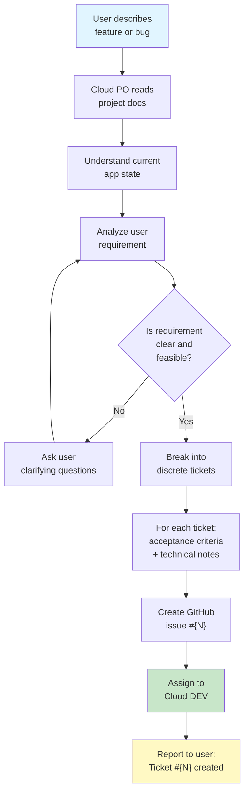
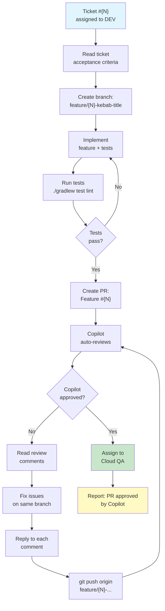
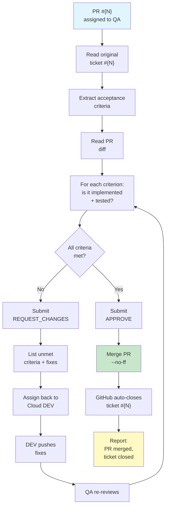
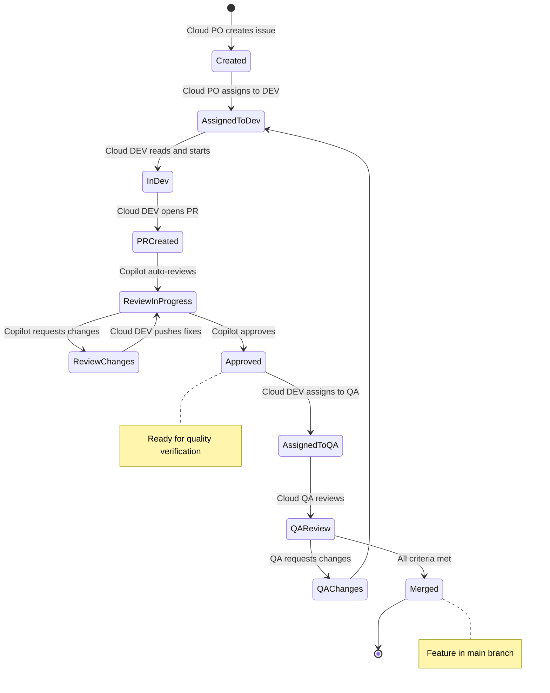
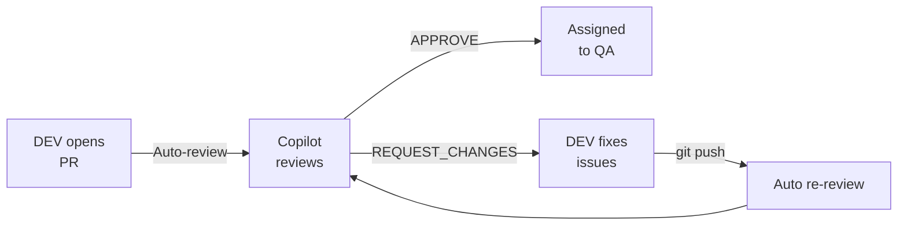
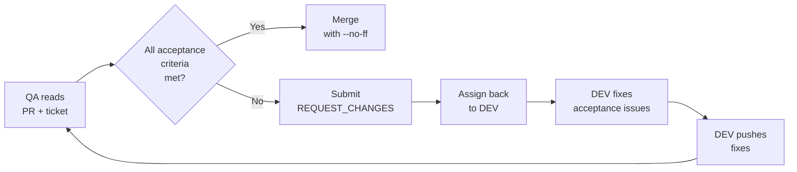

# Cloud Team Workflow Visualization

This document provides detailed workflow diagrams for the Cloud Team agents (Cloud PO, Cloud DEV, Cloud QA) and their coordination.

## Complete Cloud Team Workflow


```mermaid
sequenceDiagram
    participant User
    participant PO as Cloud PO
    participant GitHub
    participant DEV as Cloud DEV
    participant Copilot as Copilot Review
    participant QA as Cloud QA

    User->>PO: Describe feature or bug
    PO->>GitHub: Create ticket #{N}<br/>with acceptance criteria
    PO->>GitHub: Assign to Cloud DEV
    PO->>User: "Ticket #{N} created and assigned"

    DEV->>GitHub: Read ticket #{N}
    DEV->>DEV: git checkout -b feature/{N}-kebab-title
    DEV->>DEV: Implement feature + tests
    DEV->>GitHub: Create PR: "Feature #{N} <Description>"
    DEV->>GitHub: Push to feature/{N}-kebab-title

    GitHub->>Copilot: Auto-request review
    Copilot->>GitHub: Review PR

    alt Copilot Approves ✅
        GitHub->>DEV: APPROVE event
        DEV->>GitHub: Assign to Cloud QA
        DEV->>User: "PR approved by Copilot, assigned to QA"
    else Copilot Requests Changes 🔄
        GitHub->>DEV: REQUEST_CHANGES event
        DEV->>DEV: Fix issues on same branch
        DEV->>GitHub: git push origin feature/{N}-...
        GitHub->>DEV: Reply to each comment
        GitHub->>Copilot: Auto-request re-review
        Copilot->>GitHub: Review updated PR
        Note over DEV,Copilot: Loop until approved
    end

    QA->>GitHub: Read PR #{N}
    QA->>GitHub: Read ticket #{N}
    QA->>GitHub: Review PR diff

    alt All Criteria Met ✅
        QA->>GitHub: Submit APPROVE review
        QA->>GitHub: Merge PR with --no-ff
        GitHub->>GitHub: Auto-close ticket #{N}<br/>(via "Fixes #{N}")
        QA->>User: "PR merged, ticket closed"
    else Criteria Not Met ❌
        QA->>GitHub: Submit REQUEST_CHANGES
        QA->>GitHub: Assign back to Cloud DEV
        QA->>User: "QA feedback: assign to DEV"
        DEV->>DEV: Read QA comments
        DEV->>DEV: Fix acceptance criteria issues
        DEV->>GitHub: Push fixes
        Note over QA,DEV: Loop until criteria met
    end
```

---

## Cloud PO Workflow

The Product Owner is responsible for understanding requirements and creating well-defined tickets.


```mermaid
flowchart TD
    A["User describes<br/>feature or bug"] --> B["Cloud PO reads<br/>project docs"]
    B --> C["Understand current<br/>app state"]
    C --> D["Analyze user<br/>requirement"]
    D --> E{"Is requirement<br/>clear and<br/>feasible?"}
    E -->|No| F["Ask user<br/>clarifying questions"]
    F --> D
    E -->|Yes| G["Break into<br/>discrete tickets"]
    G --> H["For each ticket:<br/>acceptance criteria<br/>+ technical notes"]
    H --> I["Create GitHub<br/>issue #{N}"]
    I --> J["Assign to<br/>Cloud DEV"]
    J --> K["Report to user:<br/>Ticket #{N} created"]
    
    style A fill:#e1f5ff
    style J fill:#c8e6c9
    style K fill:#fff9c4
```

---

## Cloud DEV Workflow

The developer is responsible for implementing assigned tickets and managing the review cycle.


```mermaid
flowchart TD
    A["Ticket #{N}<br/>assigned to DEV"] --> B["Read ticket<br/>acceptance criteria"]
    B --> C["Create branch:<br/>feature/{N}-kebab-title"]
    C --> D["Implement<br/>feature + tests"]
    D --> E["Run tests<br/>./gradlew test lint"]
    E --> F{"Tests<br/>pass?"}
    F -->|No| D
    F -->|Yes| G["Create PR:<br/>Feature #{N} <Description>"]
    G --> H["Copilot<br/>auto-reviews"]
    H --> I{"Copilot<br/>approved?"}
    I -->|No| J["Read review<br/>comments"]
    J --> K["Fix issues<br/>on same branch"]
    K --> L["Reply to each<br/>comment"]
    L --> M["git push origin<br/>feature/{N}-..."]
    M --> H
    I -->|Yes| N["Assign to<br/>Cloud QA"]
    N --> O["Report: PR approved<br/>by Copilot"]
    
    style A fill:#e1f5ff
    style N fill:#c8e6c9
    style O fill:#fff9c4
```

---

## Cloud QA Workflow

The QA agent verifies that PR changes satisfy ticket acceptance criteria.


```mermaid
flowchart TD
    A["PR #{N}<br/>assigned to QA"] --> B["Read original<br/>ticket #{N}"]
    B --> C["Extract acceptance<br/>criteria"]
    C --> D["Read PR<br/>diff"]
    D --> E["For each criterion:<br/>is it implemented<br/>+ tested?"]
    E --> F{"All criteria<br/>met?"}
    F -->|No| G["Submit<br/>REQUEST_CHANGES"]
    G --> H["List unmet<br/>criteria + fixes"]
    H --> I["Assign back to<br/>Cloud DEV"]
    I --> J["DEV pushes<br/>fixes"]
    J --> K["QA re-reviews"]
    K --> E
    F -->|Yes| L["Submit<br/>APPROVE"]
    L --> M["Merge PR<br/>--no-ff"]
    M --> N["GitHub auto-closes<br/>ticket #{N}"]
    N --> O["Report:<br/>PR merged,<br/>ticket closed"]
    
    style A fill:#e1f5ff
    style M fill:#c8e6c9
    style O fill:#fff9c4
```

---

## State Transitions

### Ticket State


```mermaid
stateDiagram-v2
    [*] --> Created: Cloud PO creates issue
    Created --> AssignedToDev: Cloud PO assigns to DEV
    AssignedToDev --> InDev: Cloud DEV reads and starts
    InDev --> PRCreated: Cloud DEV opens PR
    PRCreated --> ReviewInProgress: Copilot auto-reviews
    ReviewInProgress --> ReviewChanges: Copilot requests changes
    ReviewChanges --> ReviewInProgress: Cloud DEV pushes fixes
    ReviewInProgress --> Approved: Copilot approves
    Approved --> AssignedToQA: Cloud DEV assigns to QA
    AssignedToQA --> QAReview: Cloud QA reviews
    QAReview --> QAChanges: QA requests changes
    QAChanges --> AssignedToDev
    QAReview --> Merged: All criteria met
    Merged --> [*]
    
    note right of Approved
      Ready for quality verification
    end note
    
    note right of Merged
      Feature in main branch
    end note
```

---

## Approval Gates

The workflow includes two approval gates:

### Gate 1: Copilot Code Review ✅
- **Who:** Copilot (automated)
- **When:** After Cloud DEV opens PR
- **Checks:**
    - Code quality and conventions
    - Architecture patterns (MVVM, Repository)
    - No hardcoded strings
    - Tests added for business logic
    - Error handling
- **Outcome:** APPROVE or REQUEST_CHANGES
- **Next Step:** If approved, assign to Cloud QA

### Gate 2: QA Acceptance Verification ✅
- **Who:** Cloud QA (manual)
- **When:** After Copilot approves
- **Checks:**
    - PR changes implement ticket acceptance criteria
    - All acceptance criteria are verified
    - No edge cases missed
- **Outcome:** APPROVE (merge) or REQUEST_CHANGES (back to DEV)
- **Next Step:** If approved, merge with `--no-ff`

---

## Loop Patterns

### Copilot Review Loop (DEV ↔ Copilot)


```mermaid
graph LR
    A["DEV opens<br/>PR"] -->|Auto-review| B["Copilot<br/>reviews"]
    B -->|APPROVE| C["Assigned<br/>to QA"]
    B -->|REQUEST_CHANGES| D["DEV fixes<br/>issues"]
    D -->|git push| E["Auto re-review"]
    E --> B
```

### QA Review Loop (QA ↔ DEV)


```mermaid
graph LR
    A["QA reads<br/>PR + ticket"] --> B{"All acceptance<br/>criteria<br/>met?"}
    B -->|Yes| C["Merge<br/>with --no-ff"]
    B -->|No| D["Submit<br/>REQUEST_CHANGES"]
    D --> E["Assign back<br/>to DEV"]
    E --> F["DEV fixes<br/>acceptance issues"]
    F --> G["DEV pushes<br/>fixes"]
    G --> A
```

---

## Example: Feature #42 Plant Watering Reminders

### PO Phase
```
User: "I want email reminders when plants need watering."

Cloud PO:
  1. Reads docs → understands CareScheduleService architecture
  2. Creates issue #42: "Email Reminders for Plant Watering"
     - Problem: Users need proactive notifications
     - Acceptance:
       - Emails sent 24h before watering task
       - Users can toggle per-plant
       - Global disable setting
       - All strings in strings.xml
     - Technical: Extend CareScheduleService, add EmailService
  3. Assigns #42 to Cloud DEV
```

### DEV Phase
```
Cloud DEV:
  1. git checkout -b feature/42-add-plant-watering-reminder
  2. Implement EmailReminderService + CareScheduleService updates
  3. Add unit tests for scheduling logic
  4. git push origin feature/42-add-plant-watering-reminder
  5. Create PR: "Feature #42 Add Plant Watering Reminder"
  
  Copilot reviews:
    - Requests: "DAO must return LiveData, not raw List"
  
  6. Fix PlantDao return types
  7. git push origin feature/42-add-plant-watering-reminder
  8. Reply to comment: "Fixed in commit abc1234def"
  
  Copilot approves ✅
  
  9. Assign to Cloud QA
  10. Report: "PR #42 approved by Copilot"
```

### QA Phase
```
Cloud QA:
  1. Read #42 acceptance criteria
  2. Review PR diff
  3. Check implementation:
     ✅ Emails sent 24h before watering
     ✅ Per-plant toggle in settings
     ✅ Global disable setting
     ✅ Unit tests comprehensive
     ✅ All strings in strings.xml
  
  4. Submit APPROVE
  5. Merge PR with --no-ff
  6. GitHub auto-closes #42 (via "Fixes #42" in commits)
  7. Report: "PR #42 merged. Feature in main branch."
```

---

## Key Principles

1. **Ticket-First** — All work starts with a ticket
2. **Clear Criteria** — Acceptance criteria drive quality gates
3. **Automated Review** — Copilot reviews all PRs automatically
4. **Double Gate** — Both code quality (Copilot) + acceptance (QA) required
5. **Traceable** — Ticket number in branch, PR title, and commits
6. **Isolated Work** — Each ticket has one branch, one PR
7. **Auto-Closure** — "Fixes #{N}" in commits auto-closes issue
8. **No-Fast-Forward** — `--no-ff` merges preserve history
